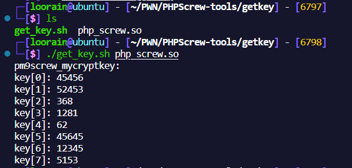

# PHPScrew-tools
scripts for php screw encrypto

## get_key.sh
This is a Script for php_screw encrypto to get the pm9screw_mycryptkey. It can only be used when the .so file is not be stripped the symbol table.

### Usage
```sh
    ./get_key.sh <file_path>
```
### example


